# 🧊 Cold Storage IoT Monitor — NRP 36

Sistem monitoring dan pengendalian cold storage berbasis IoT menggunakan **ESP32 (Wokwi)**, **HiveMQ MQTT Broker**, dan **Node-RED Dashboard**.

---

## 📋 Daftar Isi

- [Arsitektur Sistem](#arsitektur-sistem)
- [Fitur Sistem](#fitur-sistem)
- [Kebutuhan Software](#kebutuhan-software)
- [Instalasi Node.js](#1-instalasi-nodejs)
- [Instalasi Node-RED](#2-instalasi-node-red)
- [Instalasi Dashboard Node-RED](#3-instalasi-dashboard-node-red)
- [Setup Wokwi](#4-setup-wokwi)
- [Import Flow Node-RED](#5-import-flow-node-red)
- [Menjalankan Sistem](#6-menjalankan-sistem)
- [Pengujian Sistem](#7-pengujian-sistem)
- [Struktur File](#struktur-file)
- [Troubleshooting](#troubleshooting)

---

## 🏗️ Arsitektur Sistem

```
Sensor Virtual (DHT22 + Door Switch)
            ↓
      ESP32 di Wokwi
            ↓ MQTT Publish
    HiveMQ Public Broker
    (broker.hivemq.com:1883)
            ↓ MQTT Subscribe
  Node-RED (Rule Engine + Dashboard)
            ↓ MQTT Publish (perintah aktuator)
  Aktuator Virtual (LED + Buzzer di Wokwi)
```



---

## ✨ Fitur Sistem

- 📊 **Monitoring real-time** suhu dan kelembaban via gauge dashboard
- 📈 **Grafik histori** suhu dan kelembaban
- 🔔 **6 rule otomatis** termasuk rule khusus kombinasi suhu + kelembaban
- 🚨 **Alarm otomatis** saat kondisi bahaya
- 🎮 **Kendali manual** kipas dan buzzer dari dashboard
- ❌ **Error handling** sensor tidak valid (SENSOR_ERROR)
- 🔄 **Reconnect otomatis** jika koneksi MQTT terputus

---

## 💻 Kebutuhan Software

| Software | Fungsi | Link Download |
|---|---|---|
| Node.js (v18+) | Runtime untuk Node-RED | https://nodejs.org |
| Node-RED | Rule engine + dashboard | Diinstall via npm |
| Browser modern | Akses Wokwi dan dashboard | Chrome / Firefox / Edge |

> **Catatan:** Tidak perlu install MQTT broker karena menggunakan HiveMQ Public Broker yang gratis dan langsung bisa dipakai tanpa registrasi.

---

## 🛠️ Langkah Instalasi

### 1. Instalasi Node.js

1. Buka https://nodejs.org
2. Download versi **LTS** (Long Term Support)
3. Jalankan installer, klik Next sampai selesai
4. Verifikasi instalasi — buka **Command Prompt** dan ketik:

```cmd
node --version
npm --version
```

Jika muncul versi (contoh: `v18.17.0`), berarti Node.js sudah terinstall dengan benar.

---

### 2. Instalasi Node-RED

Buka **Command Prompt** (tekan `Win + R` → ketik `cmd` → Enter), lalu jalankan:

```cmd
npm install -g --unsafe-perm node-red
```

Tunggu hingga proses selesai (sekitar 2-5 menit tergantung koneksi internet).

Verifikasi instalasi:

```cmd
node-red --version
```

**Cara menjalankan Node-RED:**

Buka folder berikut di File Explorer:
```
C:\Users\[nama_user]\AppData\Roaming\npm
```
Lalu double klik file **node-red.cmd**.

> Atau bisa juga lewat Command Prompt dengan mengetik `node-red` lalu Enter.

Tunggu hingga muncul:
```
[info] Server now running at http://127.0.0.1:1880/
```

---

### 3. Instalasi Dashboard Node-RED

Dashboard adalah tampilan UI yang menampilkan gauge, grafik, dan tombol kendali.

**Langkah 1** — Buka **Command Prompt baru** (jangan tutup Node-RED yang sedang jalan), lalu:

```cmd
cd .node-red
npm install node-red-dashboard
```

Tunggu hingga muncul `added X packages`.

**Langkah 2** — Kembali ke Command Prompt Node-RED, tekan `Ctrl + C` untuk stop, lalu jalankan lagi Node-RED seperti langkah sebelumnya.

---

### 4. Setup Wokwi

Wokwi adalah simulator ESP32 berbasis browser, tidak perlu install apapun.

**Langkah 1** — Buka https://wokwi.com di browser

**Langkah 2** — Klik **New Project** → pilih **ESP32**

**Langkah 3** — Klik tab `sketch.ino` → hapus semua isinya → salin dan tempel isi file `Code Wokwi/sketch.ino` dari repo ini

**Langkah 4** — Klik tab `diagram.json` → hapus semua isinya → salin dan tempel isi file `Code Wokwi/diagram.json` dari repo ini

**Langkah 5** — Klik tab `libraries.txt` → tambahkan baris berikut:

```
DHT sensor library
PubSubClient
ArduinoJson
```

**Langkah 6** — Klik **Save** (Ctrl + S)

---

### 5. Import Flow Node-RED

**Langkah 1** — Pastikan Node-RED sudah berjalan, buka browser dan akses:
```
http://localhost:1880
```

**Langkah 2** — Klik menu **☰** (pojok kanan atas) → pilih **Import**

**Langkah 3** — Klik **select a file to import** → pilih file `flows.json` dari folder `Flow Node-RED` di repo ini

**Langkah 4** — Klik **Import**

**Langkah 5** — Klik tombol **Deploy** (merah, pojok kanan atas)

Jika berhasil, semua node akan menampilkan titik hijau bertulisan **connected**.

---

### 6. Menjalankan Sistem

Setelah semua terinstall, flow sudah di-deploy, dan Node-RED sedang berjalan:

**Step 1 — Buka Dashboard**

Buka browser tab baru, akses:
```
http://localhost:1880/ui
```
Dashboard akan tampil dengan gauge suhu, kelembaban, status sistem, tombol kendali manual, dan grafik histori.

**Step 2 — Jalankan Simulasi Wokwi**

Buka project Wokwi di browser, klik tombol **▶ Play** (hijau) untuk memulai simulasi.

Tunggu beberapa detik hingga Serial Monitor menampilkan:
```
=== Cold Storage Monitor - NRP 36 ===
[WiFi] Terhubung! IP: 10.10.0.2
[MQTT] Menghubungkan... Terhubung!
[DATA] Suhu: 24.0°C | Kelembaban: 40.0%
[STATUS] NORMAL
```

**Step 3 — Verifikasi Data Masuk**

Kembali ke dashboard (`localhost:1880/ui`), gauge suhu dan kelembaban akan menampilkan nilai dari Wokwi dan grafik histori mulai terbentuk.

---

## 🧪 7. Pengujian Sistem

### Cara ubah nilai sensor di Wokwi

Klik komponen **DHT22** saat simulasi berjalan → akan muncul slider untuk mengubah nilai suhu dan kelembaban secara manual.

### Skenario pengujian

| No. | Kondisi | Cara Simulasi | Hasil yang Diharapkan |
|---|---|---|---|
| 1 | Normal | Suhu 24°C, pintu tertutup | Status NORMAL, semua aktuator OFF |
| 2 | Suhu Tinggi | Naikkan suhu DHT22 > 34°C | LED kipas menyala, status WASPADA |
| 3 | Kritis | Suhu > 34°C + klik switch (pintu terbuka) | LED + Buzzer ON, alarm muncul, status BAHAYA |
| 4 | Kendali Manual | Klik tombol KIPAS ON di dashboard | LED Wokwi menyala, status kipas ON |
| 5 | Kembali Normal | Turunkan suhu < 28°C + tutup pintu | Semua OFF, status kembali NORMAL |
| 6 | Rule Khusus | Suhu 35°C + kelembaban > 46% | Notifikasi kombinasi muncul, status WASPADA |
| 7 | Kegagalan | Hapus koneksi DHT22 di diagram.json | Dashboard tampilkan SENSOR_ERROR |

### Cara simulasi SENSOR_ERROR

1. Klik tab `diagram.json` di Wokwi saat simulasi **sedang berjalan**
2. Hapus baris berikut dari bagian `connections`:
   ```json
   [ "dht1:SDA", "esp:4", "green", [ "v0" ] ]
   ```
3. Klik Save → sensor akan mengirim nilai tidak valid → dashboard menampilkan SENSOR_ERROR

---

## 📁 Struktur File

```
Proyek UAS/
│
├── Code Wokwi/
│   ├── sketch.ino          # Kode ESP32 untuk Wokwi
│   └── diagram.json        # Rangkaian virtual Wokwi
│
├── Flow Node-RED/
│   └── flows.json          # Flow Node-RED (import ke Node-RED)
│
├── image/
│   └── diagram_arsitektur  # Diagram arsitektur sistem
│
└── README.md               # Panduan ini
```

---

## ⚙️ Konfigurasi Sistem (NRP 36)

| Parameter | Nilai | Keterangan |
|---|---|---|
| Batas suhu waspada | 34°C | 28 + digit terakhir NRP (6) |
| Interval pengiriman | 5 detik | 2 + digit kedua terakhir NRP (3) |
| Batas kelembaban rule khusus | 46% | 40 + digit terakhir NRP (6) |
| Topic MQTT | `iot/kelas/36/telemetry` | Personalisasi NRP 36 |
| MQTT Broker | `broker.hivemq.com:1883` | HiveMQ Public (gratis) |

---

## 🔌 Pinout ESP32

| Komponen | Pin ESP32 | Keterangan |
|---|---|---|
| DHT22 DATA | GPIO 4 | Sensor suhu + kelembaban |
| Slide Switch | GPIO 15 | Simulasi door switch (INPUT_PULLUP) |
| LED Merah | GPIO 2 | Aktuator kipas (ON = kipas aktif) |
| Buzzer | GPIO 5 | Aktuator alarm |

---

## 📡 Topic MQTT

| Topic | Arah | Fungsi |
|---|---|---|
| `iot/kelas/36/telemetry` | ESP32 → Broker | Data sensor real-time |
| `iot/kelas/36/status` | ESP32 → Broker | Status kondisi sistem |
| `iot/kelas/36/alarm` | ESP32 → Broker | Notifikasi alarm |
| `iot/kelas/36/aktuator/kipas` | Broker → ESP32 | Perintah kendali kipas |
| `iot/kelas/36/aktuator/buzzer` | Broker → ESP32 | Perintah kendali buzzer |

---

## 🔧 Troubleshooting

**Node-RED tidak bisa dibuka di browser**
- Pastikan node-red.cmd sudah dijalankan dan masih aktif
- Coba akses `http://127.0.0.1:1880` (bukan localhost)

**Gauge dashboard tidak bergerak setelah Wokwi jalan**
- Cek Serial Monitor Wokwi — pastikan ada tulisan `[MQTT] Terhubung!`
- Pastikan flow sudah di-Deploy (klik tombol Deploy di Node-RED)
- Cek node **Terima Telemetry** di flow, pastikan ada titik hijau `connected`

**Node berwarna merah di Node-RED setelah import**
- Berarti node-red-dashboard belum terinstall
- Jalankan: `cd .node-red` lalu `npm install node-red-dashboard`
- Restart Node-RED

**LED Wokwi tidak menyala meskipun suhu > 34°C**
- Cek `diagram.json` — pastikan LED terhubung ke GPIO 2
- Pastikan koneksi: Anoda LED → Resistor 220Ω → GPIO 2, Katoda → GND

**Status kipas/buzzer di dashboard tidak update saat tekan tombol manual**
- Pastikan node function Status Update sudah tersambung ke node Status Kipas/Buzzer di flow
- Klik Deploy ulang setelah mengubah koneksi

---

## 📝 Lisensi

Project ini dibuat untuk keperluan akademik. Bebas digunakan sebagai referensi dengan mencantumkan sumber.
